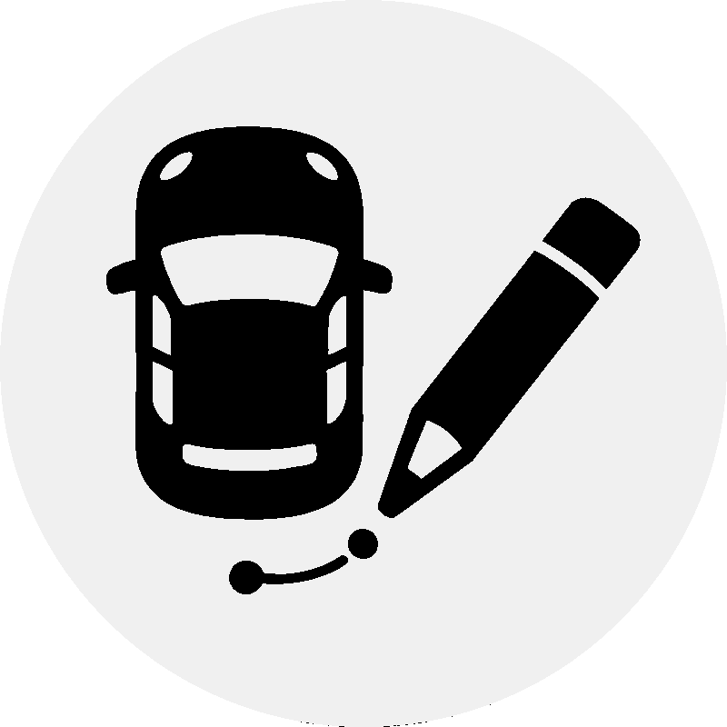
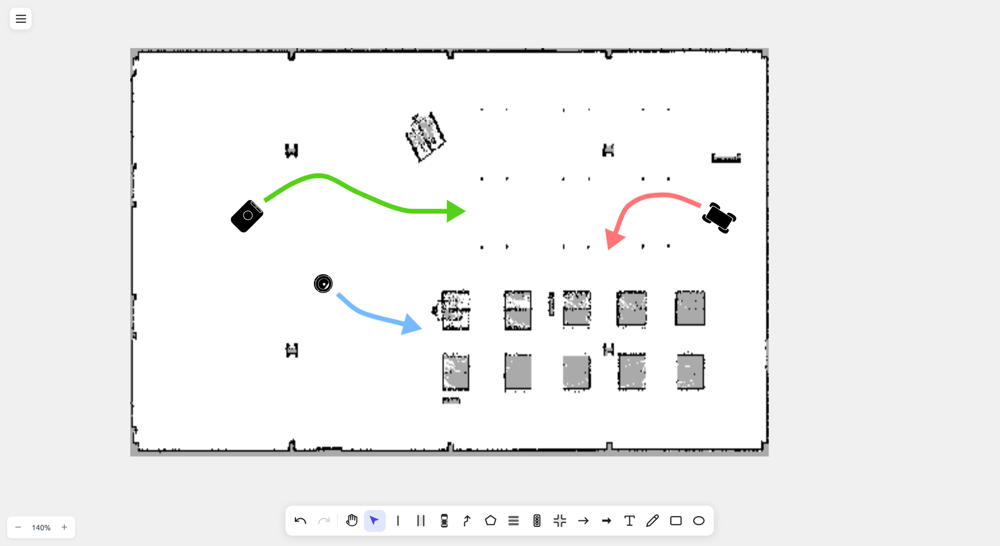

#  drawtonomy

<h3 align="center">
  Whiteboard for Driving Diagrams 🚗
</h3>

<p align="center">
  Intuitively place lanes, vehicles, pedestrians, and traffic lights.<br />
  Browser-based. For autonomous driving development, traffic planning, and driving education.
</p>

<h4 align="center">
  🌐 <a href="https://drawtonomy.com">Try it now at drawtonomy.com</a> |
  💬 <a href="https://github.com/kosuke55/drawtonomy/issues">Report issues / Request features</a>
</h4>

<video src="https://github.com/user-attachments/assets/714c13e7-e789-46d9-9e39-6cfed03b7a93" width="80%" controls></video>

## ✨ Features

- 🎨 **Infinite Canvas** - Draw extensive road networks
- 🛣️ **Lane Connection Management** - Edit with understanding of lane relationships
- ⚡ **Lane Tool** - Auto-generate from centerline or create from existing boundaries. Smooth boundaries with one click
- ➕ **Intersection Templates** - Place complex intersections with one click
- 🚙 **Rich Drawing Tools & Templates** - Various vehicles, pedestrians, traffic lights
- 🧲 **Snap Function** - Auto-snap to existing points and lines
- 🔗 **Point Sharing** - Connect shapes by sharing existing points
- 👣 **Path Footprint** - Auto-place footprints on paths with synced style, size, and orientation
- 🎨 **Style Customization** - Set color, opacity, width, and style individually
- 💾 **Editable Save Format** - Re-edit while preserving lane connection info
- 🗺️ **[Lanelet2](https://github.com/fzi-forschungszentrum-informatik/Lanelet2) Support** - Import OSM format maps
- 🤖 **ROS Map Support** - Import OccupancyGrid maps (.pgm + .yaml) from SLAM
- 🤖 **[AI Scene Generator](extensions/ai-scene-generator/)** - Generate editable scenes from natural language, OpenSCENARIO XML, or DSL

## 🎯 Main Features

### 🛣️ Lane Connection Management

Edit with understanding of lane relationships. Moving boundaries auto-transforms connected lanes. Set direction and adjacency with Next/Previous/Left/Right Lane.

<video src="https://github.com/user-attachments/assets/c353f969-55cc-4968-b300-a8a5242034fe" width="80%" controls></video>

### ⚡ Lane Tool

Auto-generate left and right boundaries by clicking the centerline. Efficiently create multiple lanes by specifying width, and draw connected lanes continuously. You can also create lanes by selecting two existing Linestrings.

<video src="https://github.com/user-attachments/assets/366cf6f2-1806-48cd-aab2-ce52596293b0" width="80%" controls></video>

Smooth lane boundaries with one click from the Attribute Panel.

<video src="https://github.com/user-attachments/assets/2f38637e-59e6-4e63-9126-f3b6dd05f143" width="80%" controls></video>

### ➕ Intersection

Place complex intersection structures with templates in one click.

<video src="https://github.com/user-attachments/assets/fdc4a482-e89b-4386-9cdf-0fa2cd978fd7" width="80%" controls></video>

### 🚙 Rich Drawing Tools & Templates

Drawing tools and shape templates for easily expressing autonomous driving scenarios.

**🚗 Autonomous Driving Focused:**

- Linestring (continuous lines for lane boundaries, etc.)
- Lane
- Vehicle (Sedan, Bus, Truck, Motorcycle templates)
- Pedestrian (Walking, Simple templates)
- Path (Arrow style, Band style)
- Polygon
- Crosswalk
- TrafficLight (vehicle and pedestrian signals)
- Intersection

**✏️ Basic Shapes:**

- LineArrow
- Arrow
- Text
- Freehand
- Rectangle
- Ellipse
- Image


### 🧲 Snap Function

Auto-snaps to existing points and lines. Hold Shift while drawing to temporarily disable snapping.

<video src="https://github.com/user-attachments/assets/5b595d73-4ed6-4644-a36e-1cfd3e44c61d" width="80%" controls></video>

### 🔗 Point Sharing

Hold Alt(Option) and click to share existing points and connect Linestring, Polygon, and Path.

<video src="https://github.com/user-attachments/assets/cdaa0d35-c40e-4a00-b90e-a1c0e48773fa" width="80%" controls></video>

### 🎨 Style Customization

Set color, opacity, width, and style individually. Change default values from the hamburger menu.

<video src="https://github.com/user-attachments/assets/75760e80-9c18-4ed6-8d8f-39ed14708482" width="80%" controls></video>

### ✏️ Segment Editing

Double-click Linestring, Lane, or Polygon to select and edit segments (between two points). Click on a segment to add new points for fine shape adjustments.

<video src="https://github.com/user-attachments/assets/97fa923f-6bfb-4bb0-86ff-ef0ebb05a9d2" width="80%" controls></video>

### 👣 Path Footprint

Generate footprints on a Path with the Generate button. Rectangle or any vehicle template (Sedan, Bus, Truck, etc.) can be set as footprints. Changing the style of one footprint syncs to all — color, template, opacity, and size changes are applied to every footprint simultaneously while maintaining equal intervals. Footprint orientation is automatically calculated from the Path direction, including smooth curves. The Anchor Offset slider lets you shift the reference point along the travel direction — for example, aligning to the base link or front bumper position instead of the center.

<video src="https://github.com/user-attachments/assets/c6633f7d-f596-4a25-9858-93e6324835ff" width="80%" controls></video>

### 📦 Export/Import

#### Supported Formats

| Format             | Export | Import | Note                  |
| ------------------ | :----: | :----: | --------------------- |
| **SVG**            | ✓      | ✓      |                       |
| **PNG**            | ✓      | ✓      |                       |
| **JPG**            | ✓      | ✓      |                       |
| **PDF**            | ✓      |        |                       |
| **EPS**            | ✓      |        | No transparency       |
| **drawtonomy.svg** | ✓      | ✓      | Re-editable           |
| **OSM (Lanelet2)** |        | ✓      |                       |
| **PGM+YAML (ROS)** |        | ✓      | OccupancyGrid map     |

> **Note on EPS export**: EPS format does not support transparency. When exporting shapes with opacity settings, the exported EPS will show shapes at full opacity, which may differ from the canvas display. For accurate transparency rendering, use PDF export instead.

<video src="https://github.com/user-attachments/assets/66365b83-4d74-4502-a204-cd9e09ae292b" width="80%" controls></video>

#### [Lanelet2](https://github.com/fzi-forschungszentrum-informatik/Lanelet2) Import

Import Lanelet2 OSM format maps for editing. Sample maps: [Autoware Documentation](https://autowarefoundation.github.io/autoware-documentation/main/demos/planning-sim/#download-the-sample-map)

<video src="https://github.com/user-attachments/assets/92cf1c66-b7d4-4142-b637-7dd9eb0a156f" width="80%" controls></video>

You can also select and import only specific lanes. For optimal performance, we recommend keeping the number of lanes under 500.

<video src="https://github.com/user-attachments/assets/652af370-8bb6-4da4-8a5b-a798b59cf7f5" width="80%" controls></video>

#### ROS OccupancyGrid Map Import

Import SLAM-generated maps from ROS `map_server` format (.pgm + .yaml). Select both files together in the file dialog. The map is automatically colored (occupied=black, free=white, unknown=gray) and scaled to match lane dimensions.

- `.pgm` + `.yaml` → Uses YAML settings (resolution, thresholds)
- `.pgm` only → Uses defaults (resolution=0.05 m/px)

Compatible with nav2, cartographer, gmapping, and other SLAM tools.

<p align="center">
  
</p>

### 🤖 [AI Scene Generator](extensions/ai-scene-generator/)

Generate editable driving scenes on the canvas from natural language descriptions, OpenSCENARIO XML, or DSL input.
AI automatically interprets the scenario and places lanes, vehicles, pedestrians, and other elements as fully editable shapes.
Supports Anthropic Claude, OpenAI GPT, and Google Gemini as AI providers.
Open from the **Extensions** button at the bottom-right of the canvas.

#### Natural Language

> *Prompt: "A 3-lane highway going left-to-right. An ego sedan (blue) in the center lane, a truck (grey) in the right lane slightly ahead. Show a dashed path for the ego vehicle changing to the left lane."*

<video src="https://github.com/user-attachments/assets/16cb1980-c912-44f0-a606-de2b50d46287" width="80%" controls></video>

#### OpenSCENARIO

Generated from [ASAM OpenSCENARIO DSL - Euro NCAP scenario example](https://publications.pages.asam.net/standards/ASAM_OpenSCENARIO/ASAM_OpenSCENARIO_DSL/latest/annexes/examples.html#_euro_ncap):

<video src="https://github.com/user-attachments/assets/ffcf0cff-11bf-406c-a3cb-9af49994015e" width="80%" controls></video>

**Contributors:** [@vishwesh5](https://github.com/vishwesh5)

## ⌨️ Keyboard Shortcuts

### Tool Switching

| Key  | Function                           |
| ---- | ---------------------------------- |
| M    | Hand (pan tool)                    |
| V    | Select tool                        |
| L    | Create Linestring                  |
| N    | Create Lane                        |
| P    | Participants (Vehicle/Pedestrian)  |
| H    | Create Path                        |
| G    | Create Polygon                     |
| X    | Create Crosswalk                   |
| I    | Create Intersection                |
| W    | Create LineArrow                   |
| T    | Create Text                        |
| D    | Create Freehand                    |

### Edit Operations

| Key                        | Function                                        |
| -------------------------- | ----------------------------------------------- |
| Ctrl+Z / Cmd+Z             | Undo                                            |
| Ctrl+Shift+Z / Cmd+Shift+Z | Redo                                            |
| Ctrl+C / Cmd+C             | Copy                                            |
| Ctrl+V / Cmd+V             | Paste                                           |
| Delete / Backspace         | Delete                                          |
| Shift                      | Temporarily disable snap (while drawing)        |
| Alt + Click                | Share existing point (Linestring/Polygon/Path)  |
| Double-click               | Segment editing (Linestring/Lane/Polygon)       |

## 🧩 Extensions

drawtonomy supports an iframe-based extension system. Build custom extensions using the SDK and postMessage API.

```bash
# Start drawtonomy locally
npm install -g @drawtonomy/dev-server
drawtonomy-dev-server

# Start your extension
cd my-extension
npm run dev -- --port 3001

# Open in browser
open "http://localhost:3000/?ext=http://localhost:3001/manifest.json"
```

Available npm packages:

| Package | Description |
|---------|-------------|
| [`@drawtonomy/sdk`](https://www.npmjs.com/package/@drawtonomy/sdk) | SDK for building extensions (ExtensionClient, shape factory functions, types) |
| [`@drawtonomy/dev-server`](https://www.npmjs.com/package/@drawtonomy/dev-server) | Local dev server for extension development |

📖 **[Extension Development Guide](docs/extensions.md)** | [日本語](docs/extensions.ja.md) | [Sample Extension](extensions/ai-scene-generator/)
